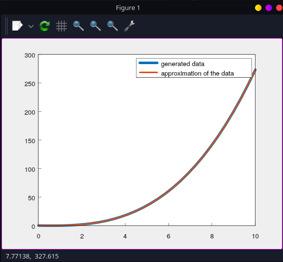

# cha1

## What's that?
An project that trys make an approximation of an polynomial coefs using linear least square method. Right now data input is randomized inside of the program if no `polynome_coefs` field in `config_init_data.json` exists. 

## Prerequisites

- a C++ compiler.
- maybe GNUplot

## How configurable is it?
Right now not so much. You can check config_init_data.json for available runtime settings.

## How to run it ?	

1. Install vcpkg : https://vcpkg.io/en/getting-started .  
Here's instructions for a Linux OS: ( for windows just `bootstrap-vcpkg.bat` )

```
git clone https://github.com/Microsoft/vcpkg.git
./vcpkg/bootstrap-vcpkg.sh
```

2. Get sources of the project, get into the folder with project, configure and compile it. In configuration command put your path to vcpkg folder.
```
git clone https://github.com/Gerodote/denisov_lab1
cd denisov_lab1
cmake -S . -B ./build -DCMAKE_TOOLCHAIN_FILE=[path to vcpkg]/scripts/buildsystems/vcpkg.cmake -Dcha1_BUILD_EXECUTABLE=1 -Dcha1_ENABLE_LTO=1 -DCMAKE_BUILD_TYPE="Release" -DCMAKE_CXX_FLAGS="-march=native"
cmake --build ./build --target all --parallel 4 
```
3. Maybe you need install `gnuplot` somehow. You'll find it out when you'll try run the project exectutable:
```
./build/bin/Release/cha1
```
You should get something like this and a window with plot:  
```  
x-axis:
       0 0.344828 0.689655  1.03448  1.37931  1.72414  2.06897  2.41379  2.75862  3.10345  3.44828   3.7931  4.13793  4.48276  4.82759  5.17241  5.51724  5.86207   6.2069  6.55172  6.89655  7.24138  7.58621  7.93103  8.27586  8.62069  8.96552  9.31034  9.65517       10
polynome coefs:
{ 0.375158, -0.61321, 0.257092, 0.253129 }
generated data:
0.375158 0.204655 0.157564 0.296159 0.682711  1.37949  2.44878  3.95285  5.95396  8.51439  11.6964  15.5623  20.1744  25.5948   31.886  39.1101  47.3294  56.6062  67.0028  78.5815  91.4045  105.534  121.033  137.962  156.385  176.364   197.96  221.237  246.257  273.081
vandermonde:
        1         0         0         0
        1  0.344828  0.118906 0.0410021
        1  0.689655  0.475624  0.328017
        1   1.03448   1.07015   1.10706
        1   1.37931    1.9025   2.62413
        1   1.72414   2.97265   5.12526
        1   2.06897   4.28062   8.85645
        1   2.41379    5.8264   14.0637
        1   2.75862   7.60999   20.9931
        1   3.10345   9.63139   29.8905
        1   3.44828   11.8906   41.0021
        1    3.7931   14.3876   54.5738
        1   4.13793   17.1225   70.8516
        1   4.48276   20.0951   90.0816
        1   4.82759   23.3056    112.51
        1   5.17241   26.7539   138.382
        1   5.51724     30.44   167.945
        1   5.86207   34.3639   201.443
        1    6.2069   38.5256   239.124
        1   6.55172   42.9251   281.233
        1   6.89655   47.5624   328.017
        1   7.24138   52.4376    379.72
        1   7.58621   57.5505    436.59
        1   7.93103   62.9013   498.872
        1   8.27586   68.4899   566.813
        1   8.62069   74.3163   640.658
        1   8.96552   80.3805   720.653
        1   9.31034   86.6825   807.044
        1   9.65517   93.2224   900.078
        1        10       100      1000
solution:
0.375158
-0.61321
0.257092
0.253129

approx_data_vector:
0.375158 0.204655 0.157564 0.296159 0.682711 1.37949 2.44878 3.95285 5.95396 8.51439 11.6964 15.5623 20.1744 25.5948 31.886 39.1101 47.3294 56.6062 67.0028 78.5815 91.4045 105.534 121.033 137.962 156.385 176.364 197.96 221.237 246.257 273.081 
Press ENTER to continue...
```

## Dependencies
1. Eigen3
2. matplot++
3. simdjson
4. boost ( boost::math if to be precise )

All of these dependencies are under or permissive licenses, or under academic licenses.  

I don't care much about the code, so I guess you can say the code has a BSD-2 license, so, do almost whatever you want to do with this ( why you w) 
## TODO
1. Get config file name from console
2. Get data file name from console and make logic for it
3. Make the code more generalized for other cases ( how ? in c++ there's no well done CAS, we don't have our SymPy like stuff, only some simple stuff. ). It needs research.
4. If 3 is impossible, allow user to define their matrices to solve the system using config file or whatever else.