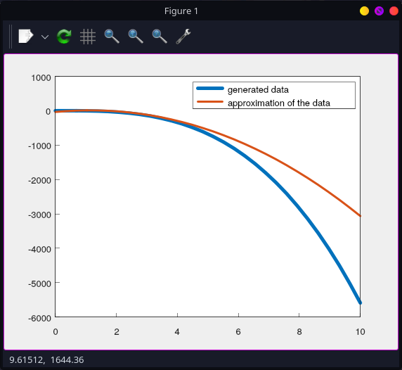

# cha1

## What's that?
An project that trys make an approximation of an polynomial coefs using linear least square method. Right now data input is randomized inside of the program. 

## Prerequisites

- a C++ compiler.
- maybe GNUplot

## How configurable is it?
Right now not so much. You can check config_init_data.json for available runtime settings.

## How to run it ?	

1. Install vcpkg : https://vcpkg.io/en/getting-started .  
Here's instructions for a Linux OS: ( for windows just `bootstrap-vcpkg.bat` )

```
git clone https://github.com/Microsoft/vcpkg.git
./vcpkg/bootstrap-vcpkg.sh
```

2. Get sources of the project, get into the folder with project, configure and compile it. In configuration command put your path to vcpkg folder.
```
git clone https://github.com/Gerodote/denisov_lab1
cd denisov_lab1
cmake -S . -B ./build -DCMAKE_TOOLCHAIN_FILE=[path to vcpkg]/scripts/buildsystems/vcpkg.cmake -Dcha1_BUILD_EXECUTABLE=1 -Dcha1_ENABLE_LTO=1 -DCMAKE_BUILD_TYPE="Release" -DCMAKE_CXX_FLAGS="-march=native"
cmake --build ./build --target all --parallel 4 
```
3. Maybe you need install `gnuplot` somehow. You'll find it out when you'll try run the project exectutable:
```
./build/bin/Release/cha1
```
You should get something like this and a window with plot:  
```  
x-axis:
       0 0.344828 0.689655  1.03448  1.37931  1.72414  2.06897  2.41379  2.75862  3.10345  3.44828   3.7931  4.13793  4.48276  4.82759  5.17241  5.51724  5.86207   6.2069  6.55172  6.89655  7.24138  7.58621  7.93103  8.27586  8.62069  8.96552  9.31034  9.65517       10
polynome coefs:
{ -0.323149, 0.486354, 1.76964, -5.7706 }
generated data:
-0.323149 -0.181627  -1.03891  -4.31463  -11.4284     -23.8  -42.8488  -69.9947  -106.657  -154.256  -214.211  -287.941  -376.867  -482.407  -605.982  -749.011  -912.914  -1099.11  -1309.02  -1544.06  -1805.66  -2095.22  -2414.18  -2763.95  -3145.95   -3561.6  -4012.32  -4499.53  -5024.65   -5589.1
vandermonde:
        1         0         0         0
        1  0.344828  0.118906 0.0141387
        1  0.689655  0.475624  0.226218
        1   1.03448   1.07015   1.14523
        1   1.37931    1.9025   3.61949
        1   1.72414   2.97265   8.83666
        1   2.06897   4.28062   18.3237
        1   2.41379    5.8264   33.9469
        1   2.75862   7.60999   57.9119
        1   3.10345   9.63139   92.7637
        1   3.44828   11.8906   141.387
        1    3.7931   14.3876   207.004
        1   4.13793   17.1225   293.179
        1   4.48276   20.0951   403.814
        1   4.82759   23.3056    543.15
        1   5.17241   26.7539   715.769
        1   5.51724     30.44   926.591
        1   5.86207   34.3639   1180.87
        1    6.2069   38.5256   1484.22
        1   6.55172   42.9251   1842.56
        1   6.89655   47.5624   2262.18
        1   7.24138   52.4376    2749.7
        1   7.58621   57.5505   3312.06
        1   7.93103   62.9013   3956.57
        1   8.27586   68.4899   4690.87
        1   8.62069   74.3163   5522.91
        1   8.96552   80.3805   6461.02
        1   9.31034   86.6825   7513.86
        1   9.65517   93.2224   8690.41
        1        10       100     10000
solution:
  -37.254
   83.204
 -35.7435
-0.283795
Press ENTER to continue...
```


## TODO
1. Get config file name from console
2. Get data file name from console and make logic for it
3. Make the code more generalized for other cases ( how ? in c++ there's no well done CAS, we don't have our SymPy like stuff, only some simple stuff. ). It needs research.